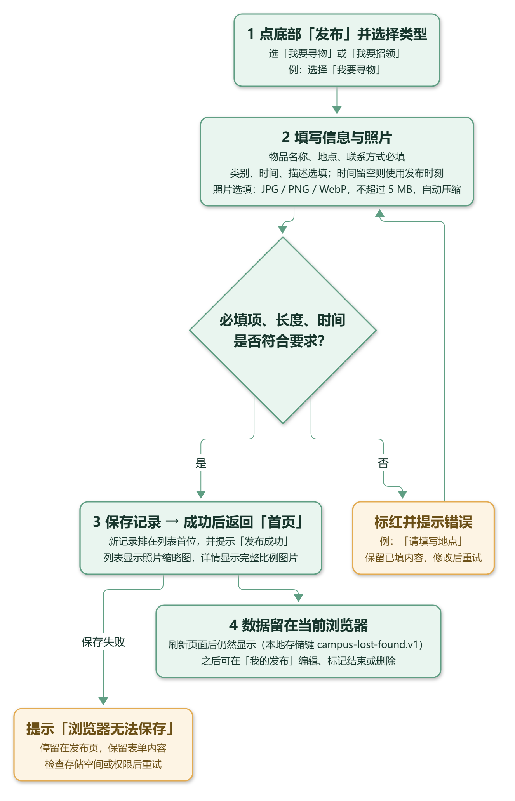
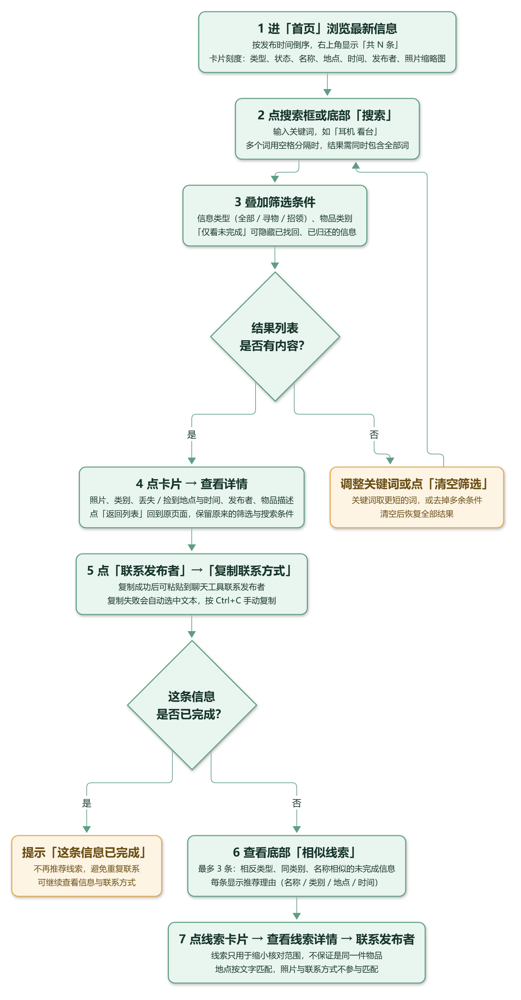
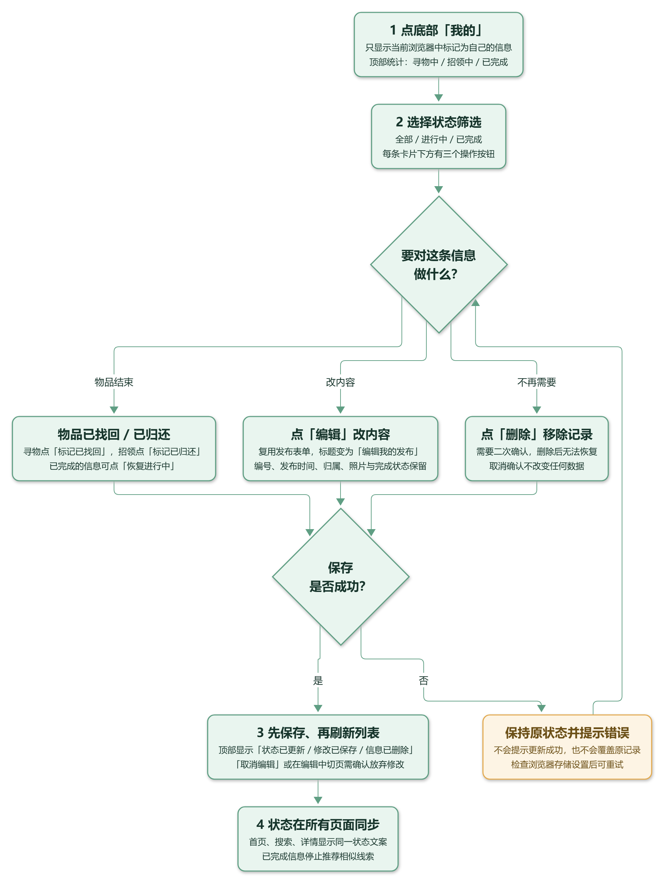

# 校园失物招领网页

2026 秋软件工程第二次结对作业，基于第一次墨刀原型实现。

本文档按**使用流程**组织：每条流程先给一张流程图（步骤框 + 判断分支 + 异常处理），再按图中的步骤号逐条说明操作、规则与异常情况。

**当前进度**：浏览、发布、搜索、详情、联系方式复制与手动备用、我的发布统计及状态筛选、已找回／已归还及恢复进行中、编辑与删除、照片上传与压缩预览、相似线索推荐均已实现。核心功能开发完成，接下来进行浏览器验收、搭档完善与提交材料整理。

## 一、使用流程总览

| 使用流程     | 适用场景                    | 入口        | 流程图                                |
| -------- | ----------------------- | --------- | ---------------------------------- |
| 流程一 发布信息 | 丢了东西要发寻物／捡到东西要发招领       | 底部导航「发布」  | [流程图 1](#流程图-1)                    |
| 流程二 浏览查找 | 看看有没有人捡到／捡到的东西是谁的       | 首页、「搜索」   | [流程图 2](#流程图-2)                    |
| 流程三 结束与维护 | 物品已找回／已归还，或要改内容、删除记录    | 底部导航「我的」  | [流程图 3](#流程图-3)                    |

三条流程共用同一份本地数据：任何一条流程中产生的记录，都会立即出现在另外两条流程的页面上。

## 二、流程一：发布信息

丢了东西要发寻物、捡到东西要发招领，都走这条流程。

### 流程图 1



### 步骤 1｜点底部「发布」并选择类型

底部导航中间的蓝色「＋ 发布」进入发布页。第一步选**信息类型**：

- **我要寻物**（默认）：你丢了东西，希望别人帮你留意；
- **我要招领**：你捡到了东西，等待失主认领。

类型决定了后续列表上的徽标（寻物／招领）、状态文案（待寻找／待认领、已找回／已归还）和详情页的推荐方向。

### 步骤 2｜填写信息与照片

| 字段        | 是否必填 | 说明                             |
| --------- | ---- | ------------------------------ |
| 信息类型      | 必填   | 即步骤 1 的选择                      |
| 物品名称      | 必填   | 最多 40 字，如「黑色雨伞」                |
| 物品类别      | 必填   | 证件／电子用品／生活用品／书籍文具／其他，决定卡片图标    |
| 丢失／捡到地点   | 必填   | 最多 80 字，如「食堂二楼门口」              |
| 丢失／捡到时间   | 选填   | 不填则自动使用发布时刻                    |
| 详细描述      | 选填   | 最多 500 字，写清颜色、外观、特征           |
| 联系方式      | 必填   | 最多 100 字；会展示在详情页，请勿填写密码等敏感内容   |
| 物品照片      | 选填   | JPG／PNG／WebP，不超过 5 MB，保存前自动压缩 |

选中照片后表单内立即出现预览图与「移除照片」按钮，并提示「照片已准备好，点击发布或保存修改后生效。」——预览只代表照片已处理好，**记录要等保存成功才真正生效**。照片会被缩到最长边 1280 像素以内、统一转成 JPEG（透明背景填充白色），压缩后数据超过 500000 字符时会提示换一张。

### 步骤 3｜保存成功并回到首页

校验通过后写入本地数据，返回首页并显示绿色提示「发布成功！信息已保存在当前浏览器，并展示在首页。」：

- 新记录排在列表首位，卡片显示照片缩略图；
- 右上角条数由「共 5 条」变为「共 6 条」。

若保存失败（存储空间不足或浏览器禁止本地保存），会提示「浏览器无法保存」，**停留在发布页并保留表单内容**，处理后可重试。

### 步骤 4｜数据留在当前浏览器

记录随照片一起存入浏览器本地存储，键名 `campus-lost-found.v1`。刷新页面后仍然显示，之后可以在流程三中编辑、标记结束或删除。

### 分支 1｜校验失败：填错时会怎样

点「发布信息」后先做校验，例如只填了类型就提交：

- 出错字段下方出现红色说明，如「请填写物品名称。」「请填写地点。」「请填写联系方式。」；
- 表单顶部汇总提示「发布未完成：请填写物品名称。」，并把焦点移到第一个出错字段；
- **已填写的内容与原列表都不会被改动**，回到步骤 2 修正后可直接重试。

超长输入同样会被拦下（名称 > 40 字、地点 > 80 字、联系方式 > 100 字、描述 > 500 字），时间格式非法时也会提示「请填写有效的日期与时间。」

### 分支 2｜保存失败

浏览器无法写入本地存储时，提示「浏览器无法保存」，表单内容保留在页面上，修复存储设置后可再次点击「发布信息」重试。

## 三、流程二：浏览查找与线索

看看有没有人捡到，或捡到的东西是谁的，都走这条流程。

### 流程图 2



### 步骤 1｜进「首页」浏览最新信息

打开 `index.html` 即进入首页。列表按发布时间从新到旧排列，右上角显示「共 N 条」。每张卡片包含：类型徽标、状态徽标、物品名称、地点 · 时间、发布者，以及右侧的照片缩略图（没有照片时显示类别图标 🪪／🎧／☂️／📚／📦）。点击卡片即可进入详情。

首页**只显示最新的 30 条**：条数超过 30 时，右上角显示「共 N 条，显示最新 30 条」，列表末尾提示「首页只显示最新 30 条，其余 M 条请用「搜索」查找。」，其余信息仍保存在本地，可随时用搜索页找到。

列表上方的「全部／寻物／招领」可按类型筛选，条数随之更新；筛选后的结果同样最多显示 30 条。

### 步骤 2、3｜搜索与叠加筛选

点首页搜索框或底部「搜索」进入搜索页。先按关键词搜索，再叠加筛选条件。

| 规则   | 说明                                    |
| ---- | ------------------------------------- |
| 匹配范围 | 物品名称、地点、类别、详细描述四个字段，任一字段包含即命中          |
| 多关键词 | 用空格分隔时必须**同时包含全部关键词**，英文忽略大小写         |
| 组合筛选 | 信息类型、物品类别、仅看未完成可任意叠加，任一条件变化即时刷新结果     |
| 无结果时 | 显示「没有找到相关信息，请尝试更短的关键词或清空筛选」，回到步骤 2 调整 |
| 恢复全部 | 点「清空筛选」清空关键词、类型、类别并取消「仅看未完成」          |

### 步骤 4｜点卡片查看详情

详情页显示照片（无照片时为类别图标）、类型与状态徽标、物品名称、类别、丢失／捡到地点与时间、发布者、发布时间、物品描述。点「返回列表」会回到进入详情前的页面，并保留原来的类型筛选或搜索条件。

### 步骤 5｜展开并复制联系方式

点「联系发布者」展开联系方式区域，再点「复制联系方式」：

- 成功时提示「已复制联系方式，可前往联系发布者。」；
- 失败时提示「自动复制失败，请在下方联系方式中按 Ctrl+C 手动复制」，并自动选中联系方式文本框，**不会误报成功**。

### 步骤 6｜查看相似线索

未完成信息的详情页底部会列出最多 3 条**相似线索**：相反类型、同类别、名称相似的未完成信息，每条都给出推荐理由，例如「物品名称相同 · 类别相同 · 地点相近（文字匹配）· 时间相差不超过 3 天」。

匹配规则如下（规则只用于缩小人工核对范围，**不保证是同一件物品**）：

| 条件   | 说明                            |
| ---- | ----------------------------- |
| 类型相反 | 寻物只推荐招领，招领只推荐寻物               |
| 类别相同 | 必须先属于同一物品类别                   |
| 名称相似 | 名称相似度低于 0.25 直接排除             |
| 时间窗口 | 两条信息的事件时间都有效时，相差超过 7 天则排除     |
| 排序   | 名称相似度为主，地点越接近、时间越接近得分越高，最多显示 3 条 |

### 步骤 7｜进入线索详情

点线索卡片进入线索详情，可查看完整信息并联系发布者；点「返回列表」回到原来的来源页面。已完成的信息不再推荐线索，底部提示「这条信息已完成，暂不推荐线索。」；没有结果时显示「暂无线索，可以稍后再查看或调整搜索条件。」

### 分支 1｜搜索结果为空

调整关键词或点「清空筛选」后重试，对应流程图中的返回步骤 2。

### 分支 2｜信息已完成

已完成的信息在详情页不再推荐线索；在搜索页勾选「仅看未完成」后也不会出现在结果中。

## 四、流程三：结束与维护

物品已找回／已归还，或要修改内容、删除记录，都走这条流程。

### 流程图 3



### 步骤 1｜进入「我的」

底部导航「我的」显示当前浏览器中标记为自己的信息。

- 顶部三张统计卡片：**寻物中／招领中／已完成**；
- 下方可按「全部／进行中／已完成」筛选。

### 步骤 2｜按状态筛选

切换筛选项即时刷新列表，统计卡片数量不受筛选影响，始终反映全部记录。

### 步骤 3｜三种操作

每条卡片下方有三个操作按钮：状态按钮、编辑、删除。对应流程图中的判断菱形「要对这条信息做什么？」。

**（1）标记已找回／已归还**

进行中的寻物显示「标记已找回」，招领显示「标记已归还」；点击后弹出确认框，确认即先保存再刷新列表，并提示「状态已更新为『已找回』，并已保存。」已完成的信息显示「恢复进行中」，可退回进行中状态。

**（2）编辑**

点「编辑」后复用发布表单：标题变为「编辑我的发布」，按钮变为「保存修改」，并出现「取消编辑」。表单自动填入原有内容，照片若已存在会直接显示在预览区，可更换或移除。保存修改后返回「我的发布」并提示「修改已保存，发布编号和完成状态保持不变。」

- 编辑**保留**发布编号、发布时间、归属、照片与完成状态；改变寻物／招领类型时状态文案随类型变化；
- 时间留空表示保留原来的丢失／捡到时间；
- 进入编辑前正在填写的新发布草稿会被暂存，退出编辑后自动恢复；
- 取消编辑或切换页面需要确认放弃，确认后原信息不变。

**（3）删除**

点「删除」需要二次确认，明确提示删除后无法恢复；取消确认不改变任何数据。

### 步骤 4｜状态在所有页面同步

修改和删除都是「先保存、后更新列表」：保存失败时保留原记录并显示错误，不会提示成功。保存成功后，首页、搜索、详情显示同一状态文案，已完成的信息在勾选「仅看未完成」后隐藏，也不再推荐相似线索。

### 分支 1｜保存失败

状态变更、编辑、删除都遵循同一原则：**保存失败不回成功提示**，原记录与原状态保持不变，可再次操作重试。

### 分支 2｜取消操作

确认框选「取消」时，不写入任何数据，页面状态与操作前完全一致。

## 五、功能与规则速查

| 主题   | 要点                                                                              |
| ---- | ------------------------------------------------------------------------------- |
| 存储   | 浏览器 localStorage，键 `campus-lost-found.v1`；仅保存在当前浏览器，不跨设备共享                      |
| 归属   | 用本地 `isMine` 字段区分，不是账号登录或服务器权限机制                                                |
| 列表排序 | 按发布时间倒序；首页类型筛选与搜索相互独立，首页筛选不写入本地存储                                               |
| 首页条数 | 首页最多展示最新 30 条（按类型筛选后同样最多 30 条），超出部分用搜索页查看；数据本身不受影响                                 |
| 搜索范围 | 搜索页不设条数上限，可检索全部信息                                                     |
| 照片   | JPG／PNG／WebP ≤ 5 MB，最长边缩至 1280 像素内转 JPEG，透明背景转白，数据 ≤ 500000 字符；无效文件保留原照片并提示      |
| 复制   | 使用浏览器剪贴板 API，失败时选中文本支持 Ctrl+C 手动复制                                             |
| 异常   | 读取到损坏或不兼容记录时暂停发布并提示，避免覆盖原数据；保存失败时表单与列表保持原状                                      |
| 单元测试 | `node --test tests/*.test.js`，当前 85 个测试全部通过                                      |

## 六、组员与分工

| 学号        | 主要职责                   |
| --------- | ---------------------- |
| 102401615 | 项目结构、页面与核心功能实现、初始测试与文档 |
| 102401622 | 功能完善、交叉测试、问题修复与代码审查    |

两人共同确认需求和接口，实际贡献以提交、PR 和过程记录为准。

## 七、目录说明

| 路径                               | 说明                                        |
| -------------------------------- | ----------------------------------------- |
| `index.html`                     | 正式网页入口                                    |
| `css/style.css`                  | 蓝白主题、信息卡片、底部导航、响应式样式                      |
| `docs/images/`                   | 三条使用流程的流程图                                |
| `js/core.js`                     | 类型筛选、首页最新 30 条上限、排序、状态文案、发布校验及数据创建、关键词搜索、详情编号查找、我的统计、状态更新及编辑删除规则 |
| `js/data.js`                     | 首次打开时使用的虚构演示数据                            |
| `js/storage.js`                  | 本地读取与保存、版本及格式检查、异常处理                      |
| `js/app.js`                      | 共享数据、卡片渲染、导航、首页筛选及发布提交                    |
| `js/pages/search.js`             | 搜索条件、组合筛选、结果列表和清空筛选                       |
| `js/pages/detail.js`             | 详情渲染、联系方式展开、复制及失败时手动选中                    |
| `js/pages/my-posts.js`           | 我的统计、状态筛选、编辑入口、状态变更和删除确认与反馈               |
| `js/recommendations.js`          | 相似线索规则、名称相似度、事件时间窗口、排序和推荐理由               |
| `js/images.js`                   | 图片校验、尺寸缩放、浏览器压缩、异步选择、防止旧结果覆盖、图片显示         |
| `js/clipboard.js`                | 异步复制结果处理，失败不会报告成功                         |
| `tests/`                         | 首页（含 30 条上限）、发布校验、存储及搜索等 85 个单元测试         |
| `docs/开发计划.md`                   | 范围、阶段提交与验收标准                              |
| `docs/PSP.md`                    | 两名成员的预估与实际耗时记录                            |
| `docs/阶段2验收.md` ~ `docs/阶段8验收.md` | 各阶段检查结果及人工验收步骤                            |
| `docs/线索推荐设计.md`                 | 加分功能的用途、匹配规则、流程及代码说明                      |
| `prototype/blog.md`              | 第一次作业的博客原稿，保留历史内容                         |
| `prototype/prototype/`           | 第一次作业附带的 HTML 参考原型                        |
| `prototype/assets/`              | 原型页面和流程图 SVG                              |
| `prototype/README.md`            | 原型来源及现有能力说明                               |

实现代码按业务规则、图片、推荐、页面及存储模块组织；文档保留各阶段验收记录。

## 八、查看现有参考原型

下载仓库 ZIP 并解压，用 Chrome 打开 `prototype/prototype/index.html`。
这是第一次作业的参考原型，不能作为第二次程序的完成版本。

## 九、运行正式网页与测试

下载仓库 ZIP 并解压，使用 Chrome 打开根目录 `index.html`，无需安装依赖或启动服务器。不要只下载 HTML，需要同时保留 css、js 文件夹。

单元测试需要 Node.js 22 或更新版本，无需安装 npm 依赖。在项目根目录执行：

```bash
node --test tests/*.test.js
```

本阶段应通过 85 个测试；后续随功能实现扩展。

## 十、数据范围

使用浏览器 localStorage，存储键为 `campus-lost-found.v1`。本地数据仅保存在当前浏览器中，不支持不同设备实时共享；不包含后台、登录、实名认证或即时聊天。

请始终在同一个目录，用同一个 Chrome 用户配置打开 `index.html` 验证刷新保存。移动文件、切换浏览器或清除站点数据后，原内容可能无法访问。`file://` 下本地存储行为依赖浏览器，应由测试人员实际验证。

如果保存失败，表单和当前列表保持原状，修复存储设置后可重试。如果读取到损坏或不兼容的记录，程序暂停发布，避免自动覆盖原数据；处理前先备份原始存储内容。

## 十一、协作约定

每完成并检查一个独立功能，提交一次。搭档在分支上完善功能或修复问题，通过 Pull Request 合并。实际耗时、发现的问题和解决过程按事实记录。
